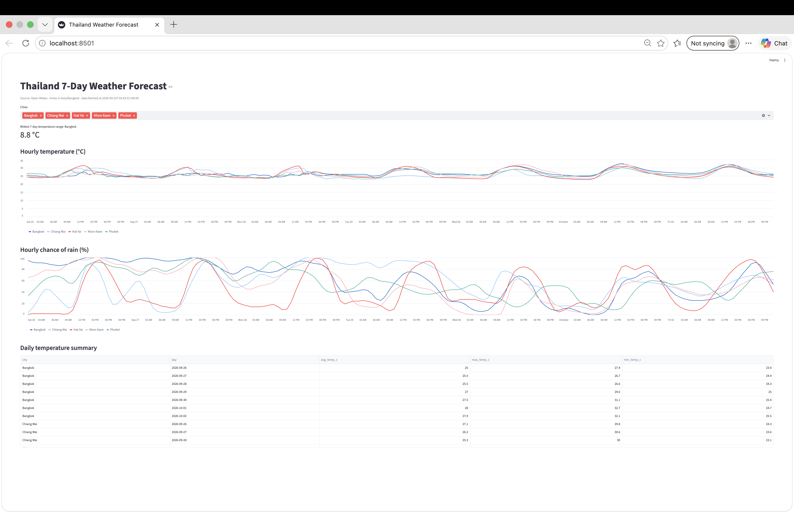

# Weather Data Pipeline

Pulls the 7-day hourly forecast for five Thai cities from [Open-Meteo](https://open-meteo.com/en/docs), keeps the raw responses, loads a cleaned table into SQLite, and presents the results as SQL outputs, a Markdown report, and a Streamlit dashboard.

Cities: Bangkok, Chiang Mai, Phuket, Khon Kaen, Hat Yai

## How to run

Requires Python 3.10+.

```bash
python3 -m venv .venv
source .venv/bin/activate
pip install -r requirements.txt

python ingest.py          # fetch, store raw, transform, load (safe to re-run)
python report.py          # writes reports/weather_report.md
streamlit run app.py      # dashboard at http://localhost:8501
```

Run a single SQL query:

```bash
sqlite3 -header -column weather.db < sql/01_daily_temperature_stats.sql
```

Or run everything with Docker (fetch, report and dashboard in one step):

```bash
docker build -t weather-pipeline .
docker run --rm -p 8501:8501 weather-pipeline
```

Then open http://localhost:8501.

## Project structure

```
ingest.py      Ingestion: fetch → raw → transform → load, with retries and logging
schema.sql     Database schema (applied automatically by ingest.py)
sql/           The four analysis queries
results/       Output of each query
report.py      Renders the query results to reports/weather_report.md
app.py         Streamlit dashboard (reads from SQLite, never calls the API)
docs/          Dashboard screenshot
Dockerfile     Runs ingest → report → dashboard in a container
```

## Results

- SQL queries: [`sql/`](sql/) · results: [`results/`](results/)
- Report: [`reports/weather_report.md`](reports/weather_report.md)
- Query choices: ties for the rainiest hour pick the earliest hour; day-over-day change is computed before rounding.



## Testing

- Ran `ingest.py` three times in a row: row counts stayed at 5 cities, 5 raw responses and 840 forecast rows.
- Inserted a fake forecast row older than the current window: removed on the next run (841 → 840).
- Set an invalid latitude for one city: that city failed and rolled back, the other four loaded, exit code 1.
- Set a 1 ms timeout: each city retried with 2 s and 4 s backoff, then failed cleanly without touching existing data.

## Summary

**Schema.** Three tables. `cities` stores each city's name, coordinates and timezone once instead of on every hourly row. `raw_api_responses` keeps each response untouched, so the data can be re-transformed without calling the API again. `hourly_forecast` has one row per city per hour with primary key `(city_id, forecast_time)`. Temperature and rain probability share that grain, so they stay in one table. Measurement columns allow NULL and carry their unit in the name.

**Idempotency.** Every write is an upsert on a natural key: `(city_id, forecast_time)` for forecasts and `(city_id, fetched_hour)` for raw responses, so re-runs overwrite instead of appending. Hours that drop out of the moving 7-day window are deleted, so the table always holds 840 rows. Each city loads in one transaction and rolls back on error; API calls retry with exponential backoff on timeouts, 429 and 5xx.

**Data issues.**
- Timezones: the API defaults to GMT and returns timestamps without an offset. I request `Asia/Bangkok` so daily grouping follows Thai days, and store the timezone in `cities`. `fetched_at` is stored in UTC.
- Nulls: stored as NULL rather than guessed; `AVG`, `MAX` and `MIN` skip them.
- Units: the response reports units in `hourly_units` (°C, %). I use the API defaults and put the unit in each column name. A production version should check `hourly_units` on every run so a unit change fails loudly.
- Gaps: arrays are zipped with `strict=True`, so mismatched lengths fail loudly instead of silently dropping hours. The API also snaps coordinates to its model grid, so I keep the requested coordinates in `cities`.

**Running hourly, all year.** Run the existing Docker image on a schedule with Airflow (or cron), using the run's hour as the raw partition key. Move raw responses to object storage partitioned by date and hour, switch to PostgreSQL, validate config and API responses, alert on failed runs, and set a retention policy for raw data.

**Insights** (run of 26 Sep 2026).
- Bangkok warms through the week: daily average rises from 25.0 °C to 28.0 °C while its peak rain probability falls from 100% to around 70%.
- Chiang Mai's coolest day (29 Sep, max only 25.2 °C) coincides with a 95% rain peak as early as 11:00. Across cities, rain usually peaks between 13:00 and 18:00.

**AI usage.** I used Claude as a tutor throughout. It explained each concept step by step and drafted most of the code (`ingest.py`, `report.py`, `app.py`, the `Dockerfile`, SQL queries 1, 3 and 4) and this README. I ran and verified every step myself and fixed the errors I hit along the way (typos in parameters and column names, a broken logging format, a query missing `GROUP BY`). I wrote the first draft of SQL query 2 and corrected it after review. Design decisions were discussed with Claude; for example, I chose to store raw responses once per city per hour after comparing it with an append-only log. I can walk through any line and explain why it is there.